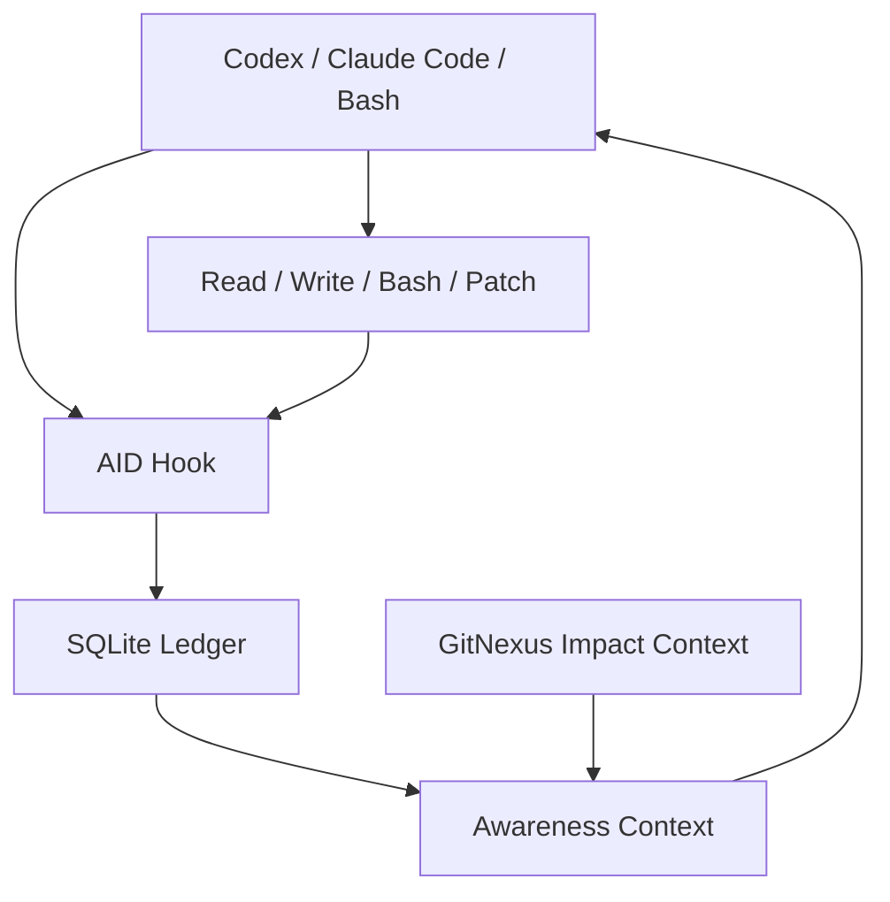

# AID

**AID = Agent Identity Daemon / Agent ID**

AID gives Codex, Claude Code, and Bash shared awareness of **who touched what, why they touched it, what happened next, and what future agents should notice before editing**.

[中文 README](README.zh-CN.md)


## Explain It Like I Am Five

Imagine a classroom cupboard that many helpers can open.

Before AID, Jane can put something in, Bob can move something, Claude can edit something, and Codex only sees the cupboard as it is now. Codex does not know who touched it or why. So it may reach in and accidentally erase what someone else just did.

With AID, every helper wears a name tag.

AID writes down:

- who came in
- what they were trying to do
- what they read
- what they changed
- whether the action later got a good, bad, mixed, or uncertain review

So the next agent does not work blind. It sees:

```text
Bob / Claude changed this file.
Goal: add risk score to payment schema.
You last read an older version.
Writing now would overwrite Bob's field.
Action: read again before editing.
```

That is the core idea: **small workers grow a little brain because the room remembers.**

## Install

```bash
curl -sfL https://raw.githubusercontent.com/Shiyao-Huang/aid/main/install.sh | bash
```

By default, AID starts in **maximum capability mode**:

- installs `aid` under `~/.aid/bin/aid`
- configures Codex hooks
- configures Claude Code hooks
- makes Codex, Claude Code, and Bash share `~/.aid/ledger.sqlite`
- installs GitNexus if missing, so AID can include code-impact context
- enables strict read-before-write checks for existing files
- keeps injected awareness short: nearest, riskiest, highest-signal context first

Options:

```bash
curl -sfL https://raw.githubusercontent.com/Shiyao-Huang/aid/main/install.sh | bash -s -- --target codex
curl -sfL https://raw.githubusercontent.com/Shiyao-Huang/aid/main/install.sh | bash -s -- --target claude
curl -sfL https://raw.githubusercontent.com/Shiyao-Huang/aid/main/install.sh | bash -s -- --without-gitnexus
curl -sfL https://raw.githubusercontent.com/Shiyao-Huang/aid/main/install.sh | bash -s -- --dry-run
```

To relax the default locally:

```bash
AID_STRICT_MISSING_READ=0 aid check-write path/to/file.py
AID_GITNEXUS=0 aid awareness path/to/file.py
aid check-write path/to/file.py --allow-missing-read
aid awareness path/to/file.py --lines 12
```

## The Wow Demo

Run:

```bash
PYTHONPATH=. python3 examples/wow_demo.py
```

### Scene 1: Without AID

Alice reads version 1. Bob changes the file and adds a new field. Alice writes from old memory.

Result: Bob's field disappears. Nobody knows why. Debugging starts from ashes.

### Scene 2: With AID

The same story happens again, but when Alice / Codex tries to write, AID blocks it:

```text
Decision: BLOCK
Recent write: Bob / claude-bob
goal: add risk score to payment schema
```

Before:

```text
Why did it break? Who changed this? Why are tests exploding?
```

After:

```text
Do not write. Bob changed this after your last read. Read again first.
```

That is the jump from tool calls to workspace awareness.

### Scene 3: Feedback Becomes Memory

A later review can say:

```text
bad: Changed a shared schema while Alice had an older read.
```

AID turns that into future behavior context. Traceability is not the end. **Traceability lets the next agent adapt.**

### Scene 4: Bash Gets A Name Tag Too

```bash
aid run --goal "write release note" --actor shell-user -- "printf 'ship it\n' > release.txt"
aid recent release.txt
```

Plain Bash now appears in the same timeline as Codex and Claude Code.

### Scene 5: GitNexus Adds Danger Sense

When GitNexus is enabled and the repo is indexed, AID can add impact context:

```text
GitNexus importance: high
GitNexus context: critical API handler impact: callers, process flow, route map, execution flow
```

The agent sees not just **who touched this file**, but **why, how risky it is, and what previous feedback says**.

## What AID Records

AID stores a local SQLite timeline:

- agent identity: Codex, Claude Code, Bash, human shell
- session ID and actor ID
- current goal or user intent
- registered tool activity, not only reads and writes
- read and write events
- preconditions, such as read-before-write
- stale-write hazards
- semantic evaluations: good, bad, mixed, uncertain
- outcomes and adaptation hints
- optional GitNexus file importance and impact context

## Commands

```bash
aid doctor
aid awareness path/to/file.py
aid recent path/to/file.py
aid check-write path/to/file.py
aid chain <event-id>
aid evaluate <event-id> --verdict bad --reason "Changed schema without reading latest file."
aid run --goal "manual shell edit" -- "printf 'hello\n' > note.txt"
aid tool list
aid tool register image_gen.imagegen --category asset.generate --impact high \
  --description "Generate or edit project image assets" \
  --resource-hint "may create files under assets/"
aid tool explain image_gen.imagegen
```

The bundled `aid` skill is also an operator manual. It explains how to use AID, register new tools, and safely modify AID itself.

## Architecture



Every registered tool can leave a trace. Before a resource-changing write, AID asks:

- did this session read the file?
- did someone else change it after that read?
- who changed it, and what was their goal?
- did past operations on this file get useful feedback?
- does GitNexus think this file is important?

Then AID injects a short awareness note or blocks a risky write. In maximum mode, an existing file must be read by the current session before writing.

## What AID Is Not

AID is not a Git replacement. Git records commits. AID records the live working-room story before a commit exists.

AID is not a GitNexus replacement. GitNexus explains code impact. AID explains identity, intent, operation chains, and feedback.

AID does not force agents into one hard-coded collaboration style. It gives each agent self, others, environment, and consequences. Collaboration can emerge from that.

## Interop With Selftools / AIDS

AID borrows the ToolEnvelope idea from selftools/AIDS: hook metadata includes a compact `aid.tool-envelope.v1` object with runtime, phase, tool, session, intent, and timestamps. That makes AID easier to bridge into JSONL timeline systems while keeping SQLite as the local query engine.
