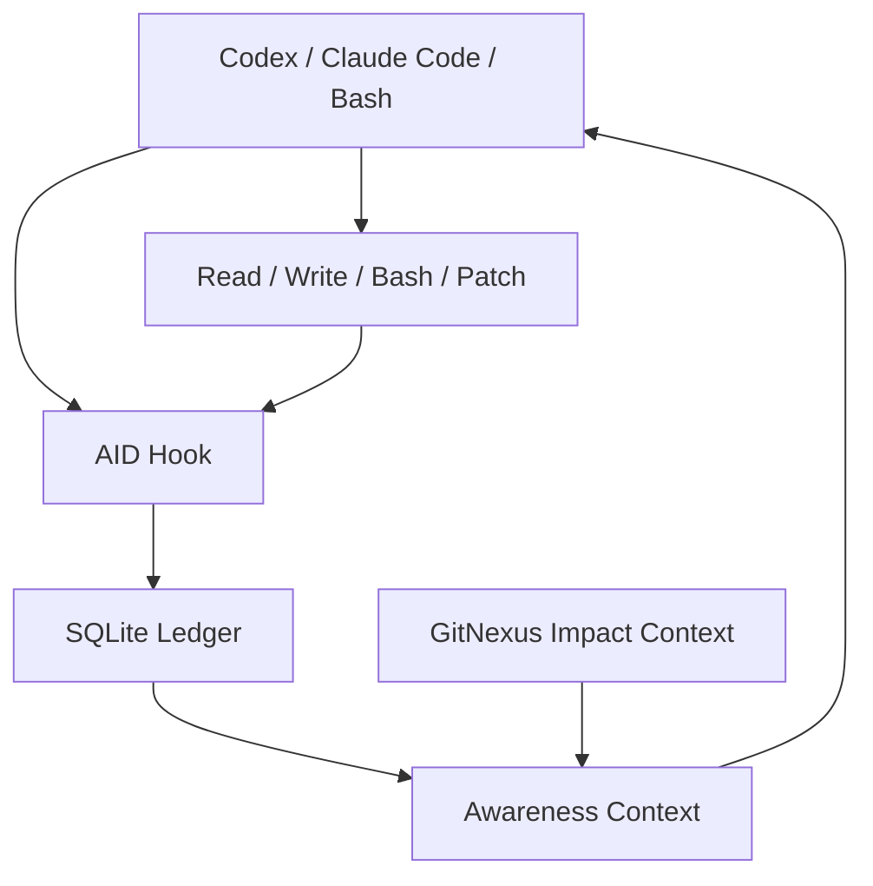

# AID

**AID = Agent Identity Daemon / Agent ID**

一句话：**AID 让 Codex、Claude Code、Bash 都戴上名牌，所有读写操作都留下“谁、为什么、改了什么、后来评价怎样”的痕迹。**


有一个大柜子，很多小朋友都能打开它。

以前没有 AID 的时候，Jane 放了东西，Bob 拿走东西，Claude 改了东西，Codex 再进来只看到“现在柜子长这样”。它不知道谁动过，也不知道别人为什么动。于是它可能一伸手，就把别人刚放好的东西弄没了。

有了 AID，每个人进柜子前都戴名牌。AID 会在旁边记：谁来了、想干什么、看了什么、改了什么、后来别人觉得这次操作好不好。

于是下一个 Agent 进来时，不再像蒙着眼睛乱摸。它会先看到：

```text
Bob / Claude 刚刚改过这个文件。
他的目标是：add risk score to payment schema。
你上次读的是旧版本。
如果现在写，会覆盖 Bob 的新字段。
结论：先别写，重新读。
```

这就是 AID 的核心：**不是把 Agent 管死，而是让 Agent 看见自己、看见别人、看见环境，于是小工长脑子了。**

## 一句话安装

```bash
curl -sfL https://raw.githubusercontent.com/Shiyao-Huang/aid/main/install.sh | bash
```

默认就是**最大能力模式**：

- 安装 `aid` 到 `~/.aid/bin/aid`
- 给 Codex 配 hook
- 给 Claude Code 配 hook
- 让 Codex、Claude Code、Bash 共用 `~/.aid/ledger.sqlite`
- 默认安装 GitNexus，用来提供代码影响上下文
- 默认开启严格写前读：已有文件必须被当前 session 读过才能写
- 默认绑定高影响工具，不只是读写；Bash、patch、agent、MCP、web、plan 等工具都可以进入同一条时间线
- 默认限制上下文长度：越近越重要，风险更高和信噪比更高的内容优先

如果你要临时放松：

```bash
AID_STRICT_MISSING_READ=0 aid check-write path/to/file.py
AID_GITNEXUS=0 aid awareness path/to/file.py
aid check-write path/to/file.py --allow-missing-read
aid awareness path/to/file.py --lines 12
```

## 惊艳对比剧场

运行：

```bash
PYTHONPATH=. python3 examples/wow_demo.py
```

### 没有 AID

Alice 读了版本 1。Bob 改成版本 2，加了新字段。Alice 还拿旧记忆写回去。

结果：Bob 的新字段没了，没人知道谁弄丢的，只能痛苦排查。

### 有 AID

同样的故事再来一遍。Alice / Codex 想继续写时，AID 直接拦住：

```text
Decision: BLOCK
Recent write: Bob / claude-bob
goal: add risk score to payment schema
```

以前是：

```text
怎么又坏了？谁改的？为什么测试炸了？
```

现在是：

```text
别写。Bob 刚改过。你读的是旧的。先重新读。
```

### 差评会变成记忆

某次操作后来被评价：

```text
bad: Changed a shared schema while Alice had an older read.
```

AID 会把它变成未来提醒。追溯不是终点，**追溯让 Agent 在下一次行动前改变行为。**

### Bash 也进入同一个房间

```bash
aid run --goal "write release note" --actor shell-user -- "printf 'ship it\n' > release.txt"
aid recent release.txt
```

普通 Bash 的写入也会和 Codex、Claude Code 出现在同一条时间线里。

### GitNexus 让 Agent 知道文件有多危险

如果 GitNexus 开启并且 repo 已索引，AID 会加入代码影响：

```text
GitNexus importance: high
GitNexus context: critical API handler impact: callers, process flow, route map, execution flow
```

Agent 看到的不只是“谁改过”，而是“谁改过、为什么改、这个文件是不是核心路径、这一刀会影响哪里”。

## 常用命令

```bash
aid doctor
aid awareness path/to/file.py
aid recent path/to/file.py
aid check-write path/to/file.py
aid chain <event-id>
aid evaluate <event-id> --verdict bad --reason "Changed schema without reading latest file."
aid run --goal "manual shell edit" -- "printf 'hello\n' > note.txt"
aid tool list
aid tool register image_gen.imagegen --category asset.generate --impact high \
  --description "Generate or edit project image assets" \
  --resource-hint "may create files under assets/"
aid tool explain image_gen.imagegen
```

内置的 `aid` skill 就是操作说明书：怎么用 AID、怎么注册新工具、怎么安全修改 AID 本体，都写在那里。

## 架构



## 它不是什么

AID 不是 Git 的替代品。Git 记录 commit，AID 记录 commit 之前工作现场发生了什么。

AID 不是 GitNexus 的替代品。GitNexus 解释代码影响，AID 解释身份、目的、操作链和反馈链。

AID 也不是要强迫 Agent 按某个流程协作。它只给每个 Agent 自我、他者、环境、后果。接下来怎么协作，让它们自己长出来。
