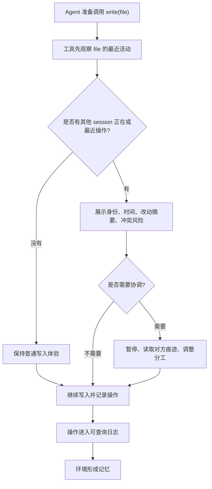

# Agent 工具自指与身份意识

## 一句话压缩

当 Agent 从串行聊天走向并行协作后，工具系统必须让每一次操作都带有可查询的身份、时间、痕迹和冲突提示，让世界、环境和工具具备自指能力。

## 三句话压缩

并行 Agent 的协作不能只依赖聊天窗口，因为很多信息会通过文件、工具调用、改动痕迹和环境状态来交流。  
一个共享环境像多人共用的柜子：每个人放了什么、什么时候放的、是否危险，都应该带标签、可观察、可追责。  
因此 Codex、Claude 这类 Agent 的工具层需要被重新封装，让 `write` 等操作在执行前后都能暴露“谁在用、改了什么、有没有别人最近改过、是否会冲突”。

## 五句话压缩

当 Agent 不再串行工作，而是在同一个环境中并行行动时，信息交流会从显式聊天转向隐式痕迹。  
这些痕迹包括文件改动、工具调用、会话身份、最近操作、冲突风险和他人留下的上下文。  
共享柜子的比喻说明了核心问题：物品必须带标签，危险物品必须被发现，错误行为必须可追责。  
工具系统要拥有自指能力：每个工具知道自己被谁调用、正在影响什么对象、之前谁影响过同一对象。  
最终目标是让 Agent 操作系统具备身份意识和环境意识，使多 Agent 协作从“互相猜”变成“可观察、可查询、可协调”。

## 原始记录

这里是一个比较特别的 insight，因为我发现我们发现在所有的工具里边，的 agents 不再是串行以后，那就会遇到一些问题，很多的信息不再是通过 chatting room 去交流的，而是通过我们发现队友的蛛丝马迹进行交流的。

这就像我们实际上在生活中，我把眼睛看过去，我应该是看到非常多的东西，然后才找到我想要的那个东西。我知道我要去翻柜子，而我打开柜子的时候，看到了我要的东西在哪里。同时我也突然就回忆起来，我之前在柜子里放了什么东西。

而如果这个柜子是有很多人在里边用的话，我就知道了。原来 Jane 在里边放了一盒蛋白粉，AC 在里边放了一个他的扑克牌，因为上面都有标签嘛，写着他们的名字。

然而突然我看见里边有一个敌敌畏，然后上面写着 K，后续我们所有人都去批 K，这样放东西是很不负责任的，再放我们就要进行惩罚了。

好的，上面暴露出一个什么问题呢？就是我们的所有操作是在一个时空里边有标签的，能被观测到的。

现在去 tools 里边看看，在 Agent 整个的操作系统里边，任何 Agent 去改一个文件的时候，在使用 `write` 这个工具的时候，`write` 被哪些人使用了，改了什么。比如说我在使用 `write`，然后后面跟着一个函数是 write 这个文件，那我一进去，这两个组合就一定会被告诉我说谁谁谁刚才来改了，或者说没有人改，那我就知道我要观察对面这个人改了啥东西，别冲突了，是让他改还是我改。也就是说上面我们再去提炼一下。

世界需要自指，环境需要自指。工具也需要自指。而且，如果没其他人用的话，没关系啊，就和以前的调用方式一样了。假如出现了其他人正在使用，或者说最近使用，它就变成了一个系统的自我意识？

而这件事情只需要我们去封装出一套工具，完全替代 Claude 和 Codex 的整个工具集就可以了。而谁去改这个事情，那每一个 session 它都应该有一个 ID，有它自己的 ID，暴露出这个 ID 是可以被查询到的。大家都知道去哪儿去查询这个东西，就像在车间里大家知道自己的名牌，然后也知道去排班表那儿去看这个人，这个名字到底是谁，就能查到了呀。

所以在这样的情况下，理解抽象，核心就是让 Codex 和 Claude 的工具拥有自我意识和身份意识。

## 结构化提炼

### 1. 主要矛盾

串行 Agent 的主要协作界面是聊天记录；并行 Agent 的主要协作界面会变成共享世界里的操作痕迹。  
如果工具层不暴露这些痕迹，Agent 就会在同一个空间里互相遮挡、互相覆盖、互相误判。

### 2. 柜子模型

共享环境像一个多人共用的柜子：

- 看见物品：环境必须能被观察。
- 看见标签：每个对象和操作必须有归属。
- 看见历史：我能回忆起自己之前放了什么，也能看到别人留下了什么。
- 看见危险：不负责任的操作必须被发现。
- 形成规范：发现危险后，团队可以批评、约束和惩罚。

这个模型说明：环境不是被动容器，而是一个带有记忆、身份和规则的协作界面。

### 3. 工具自指

工具自指不是让工具“说很多话”，而是让工具在关键时刻回答几个问题：

- 我是谁在调用？
- 我正在操作什么对象？
- 这个对象最近被谁操作过？
- 对方改了什么？
- 当前操作是否可能冲突？
- 如果没有其他人参与，能否保持原来的轻量调用方式？

因此，`write(file)` 不应该只是写文件，它应该变成：

```text
observe(file) -> report recent activity -> decide/coordinate -> write(file) -> record operation
```

### 4. 身份意识

每个 session 都应该拥有可查询的 ID。这个 ID 不只是日志字段，而是协作系统中的名牌。

它需要支持：

- 谁正在操作。
- 谁最近操作过。
- 谁负责某个改动。
- 谁与谁可能冲突。
- 去哪里查询 session ID 对应的人、Agent 或任务。

这类似车间里的名牌和排班表：人可以移动，任务可以变化，但身份和责任链要能被查到。

### 5. 系统自我意识

当没有其他 Agent 使用同一个资源时，工具表现得和普通工具一样。  
当检测到其他 Agent 正在使用或最近使用同一个资源时，工具开始暴露协作上下文。  
这种“按需显现”的机制，就是系统级自我意识的雏形。

## Mermaid 镜子



## 我的思考

这段 insight 的关键不是“加一个日志系统”，而是把工具从单人命令行升级成多人共享世界的感知器官。以前的工具只关心输入和输出；并行 Agent 时代的工具还要关心上下文、归属、时间和相邻行动。

真正有价值的抽象是：工具调用本身就是一个观察点。每次 `read`、`write`、`edit`、`run`、`search` 都可以让 Agent 看见世界的一部分，也让世界记录 Agent 的一部分。这样，工具不只是执行动作，而是在维护一个协作现场。

这个系统应该避免过度打扰。只有当资源被多人共享、最近被改动、存在冲突风险或涉及高风险操作时，自指信息才需要浮出水面。否则它应该保持像普通工具一样轻。

可以把它分成五层能力：

- 身份层：每个 session 和 Agent 都有 ID。
- 观察层：工具能看到目标资源的最近活动。
- 记忆层：操作被记录成可查询历史。
- 协调层：冲突、重叠和危险操作会被提示。
- 规范层：团队可以基于痕迹形成责任、复盘和惩罚机制。

## 下一步问题

如果继续往下实现，第一轮问题可以这样问：

- `write` 工具应该在写入前展示哪些最小信息？
- session ID 应该由谁生成、在哪里注册、如何查询？
- 文件级、函数级、行级，哪一种粒度最适合作为冲突观察单位？
- 操作日志应该存在哪里，怎样避免变成噪音？
- 怎样让 Claude、Codex 和其他 Agent 共用同一套身份与工具协议？

更本质的问题是：

> 怎样让工具在不增加单人使用负担的前提下，为并行 Agent 协作提供可观察、可追责、可协调的共享现实？
