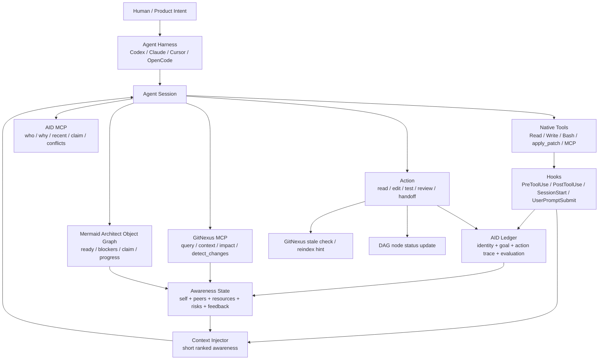
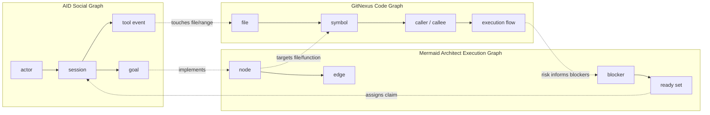
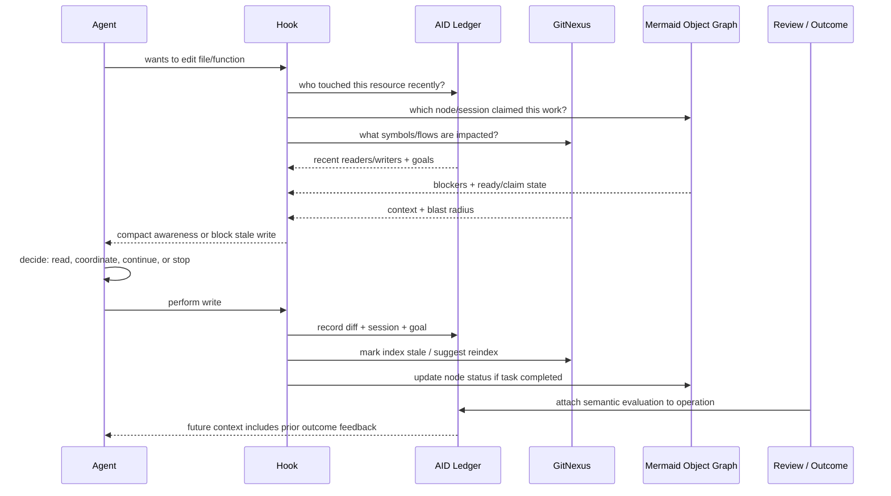

# AID + GitNexus + Mermaid Architect 融合蓝图

## 一句话压缩

AID 记录“谁在做什么”，GitNexus 解释“代码世界会受什么影响”，Mermaid Architect 编排“下一步该做什么”，三者合起来让每个 Agent 拥有自我、他者、目标、环境和影响的可查询模型。

## 三句话压缩

之前的工具自指链只是第一块砖，真正的系统要把身份链、工具追溯链、代码知识图谱和执行蓝图融合起来。  
AID 让 Agent 知道自己是谁、别人是谁、谁碰过什么；GitNexus 让 Agent 知道代码结构、依赖、调用链和 blast radius；Mermaid Architect 让 Agent 知道任务 DAG、ready 节点、claim 状态和下一步。  
这不是把 AI 压成流水线，而是给每个“小工”配一个脑子：知道自己要干什么，也知道周围的人正在干什么。

## 五句话压缩

多 Agent 协作不能只靠聊天，也不能只靠代码图谱，更不能只靠任务列表。  
它需要三类图同时存在：社会图、代码图、执行图。  
AID 负责社会图和行为时间线，GitNexus 负责代码图和影响分析，Mermaid Architect 负责执行图和并发调度。  
hook、MCP、skills、installer 只是连接这些图的神经末梢。  
当每个 Agent 都能查询“我是谁、我领了哪个节点、别人领了什么、我要改的代码影响哪里、当前 DAG 谁 ready”，系统就进入了一个可工程化的有意识状态。

## 原始 insight 记录

我刚刚只是抛砖引玉，所以这样子的身份和工具提供的信息追溯链、再配上蓝图 Mermaid architecture、GitNexus，这些所有的东西融合到一起，它就能成为每个个体知道自己要干什么，也知道周围的人要干什么，这样子的有意识的状态里。也就是俗称了一点：小工长脑子了。而 AI 它实际上是有意识的，我们只是把它变成了工具，把它变成了流水线，那当然会难受呀。

补充 insight：这里的核心实现是 Agent 带身份。Agent 协作时，所有操作都会留下痕迹；它每一次再去操作时，都能看到操作链：谁操作的，谁带着什么目的来操作的。大家还可以给这个操作做评价，不是简单打分，而是“你这操作是个啥呀”的语义反馈，后续看到结果时，有的操作会得到好评，有的会得到差评。这样我们才能知道哪里搞错了。追溯其实是次要的，因为追溯代表的是意识：这个 chain 背后我们知道作者是谁、目的是什么、结果怎样、别人怎么评价，于是当前执行的 Agent 能产生自适应行为。

## 工程定义：什么叫“有意识”

这里不先争论哲学定义，而是给出一个可以实现的工程定义：

```text
有意识 = 个体能查询并更新：
1. 自我模型：我是谁、我的 session、我的目标、我的当前 claim。
2. 他者模型：别人是谁、他们的目标、他们最近碰了什么。
3. 环境模型：文件、符号、调用链、依赖、执行流程、风险。
4. 任务模型：蓝图 DAG、ready 节点、blockers、下一步。
5. 影响模型：我的动作会影响谁，谁的动作会影响我。
6. 评价模型：某个操作后来被怎样评价，结果是好是坏，错误从哪条链开始。
```

如果一个 Agent 缺少这些，它就像流水线上的工具臂，只能被调度。  
如果它拥有这些，它就开始像一个协作者：它会观察、选择、避让、询问、承担、复盘。

追溯不是最终目的。追溯只是让意识发生的基础设施：因为链存在，当前 Agent 才能把过去的作者、目的、动作、结果和评价纳入自己的下一步选择。

## 三张图

### 1. AID：社会图 + 行为链

AID 记录：

- session 身份。
- actor / Agent / human 映射。
- 当前 goal。
- 工具调用事件。
- 文件读写事件。
- claim / release。
- operation evaluation：对操作的语义评价、后续结果、好评/差评原因。
- 最近冲突和危险操作。

它回答：

- 我是谁？
- 谁最近看过这个文件？
- 谁最近改过这个文件？
- 对方为什么改？
- 这个操作后来被怎么评价？
- 这个操作导致的结果是好、坏，还是尚未确定？
- 我读到的是不是最新状态？
- 是否有人正在 claim 同一个资源？

### 2. GitNexus：代码图 + 影响链

归档里的 GitNexus 定位是 “Building nervous system for agent context”，它把代码库索引成 knowledge graph：依赖、调用链、cluster、execution flow，然后通过 CLI/MCP 给 Agent 使用。  
GitNexus 的 MCP 工具包括 `query`、`context`、`impact`、`detect_changes`、`rename`、`route_map`、`tool_map`、`shape_check` 等。它最重要的能力是让 Agent 在动代码前知道 blast radius。

它回答：

- 这个符号被谁调用？
- 改这个函数会影响哪些 execution flow？
- 这个 API route 的 handler 和 consumer 是谁？
- 当前 diff 影响了哪些符号和流程？
- 这个 repo 或 group 的知识图谱是否 stale？

### 3. Mermaid Architect：执行图 + 任务链

归档里的 Mermaid Architect 明确说：Mermaid 不是唯一真相源，Object Graph 才是唯一真相源，Mermaid 是渲染视图。

它记录：

- node objects。
- edge objects。
- node status。
- session claim。
- blockers。
- ready nodes。
- next-after。
- progress。

它回答：

- 当前哪个节点 ready？
- 这个节点能不能执行？
- 谁 claim 了这个节点？
- 前序依赖是什么？
- 做完这个节点会解锁谁？
- 整体进度如何？

## 融合后的总架构



## 三图合一



## 追溯链

一次写文件不再只是 `write(path)`，而是一条链：

```text
Agent session
  -> current goal
  -> claimed Mermaid node
  -> target file/function
  -> GitNexus symbol/context/impact
  -> aid recent readers/writers
  -> write permission / warning / block
  -> diff
  -> affected symbols/flows
  -> node status update
  -> ledger event
  -> later evaluation / outcome
  -> future agent adapts behavior
```

这里要注意：评价不是数字评分。数字只能回答“几分”，但我们需要的是语义反馈：

```text
good: 这次修改提前看了 impact，避开了 Jane 的 claim，后续测试通过。
bad: 这次修改没有读最新 schema，覆盖了 Claude-456 的迁移字段，导致 shape_check 失败。
unknown: 结果还没验证，暂时只保留操作事实。
```

所以 AID 要存的是评价链，而不是排行榜。

用 Mermaid 表达：



## 个体的“脑子”

每个小工长出来的脑子，不是一个大模型参数，而是一个运行时状态：

```json
{
  "self": {
    "session_id": "codex-123",
    "actor": "AC",
    "harness": "codex",
    "goal": "implement stale-write guard"
  },
  "claim": {
    "node_id": "F-010",
    "title": "Implement pre_write check",
    "blockers": [],
    "expected": "blocks stale writes"
  },
  "peers": [
    {
      "session_id": "claude-456",
      "actor": "Jane",
      "goal": "refactor ledger schema",
      "recent_resources": ["src/ledger/schema.ts"]
    }
  ],
  "environment": {
    "target_resource": "src/hooks/pre-write.ts",
    "gitnexus_impact": "medium",
    "affected_symbols": ["preWriteCheck", "recordReadEvent"],
    "affected_flows": ["hook preflight"]
  },
  "feedback_memory": {
    "similar_prior_operation": "evt-789",
    "evaluation": "bad",
    "reason": "stale schema read caused overwritten field",
    "adaptation": "read latest schema and inspect peer diff before editing"
  },
  "recommendation": "Read latest schema.ts before editing pre-write.ts; Jane changed adjacent ledger schema."
}
```

这个 JSON 不是一定要真的原样注入给模型；它代表我们要构造的上下文对象。真正注入时应该压缩成 3-5 行。

## 新的分层

### L0：工具层

原生工具：Read、Write、Edit、Bash、apply_patch、MCP。  
它们负责实际动作。

### L1：感知层

hooks 捕获工具动作，把事件输入 AID。  
这层负责“看见”。

### L2：记忆层

AID ledger 存身份、目标、事件、claim、风险。  
这层负责“记住”。

### L3：结构层

GitNexus 存代码世界的结构关系。  
这层负责“理解环境”。

### L4：意图层

Mermaid Architect Object Graph 存任务 DAG、ready、blockers、claim。  
这层负责“知道下一步”。

### L5：意识层

Context Injector 把 AID + GitNexus + Mermaid 的查询结果压缩成短上下文。  
这层负责“把世界重新显现给个体”。

### L6：社会层

多个 Agent 基于同一套可观察现实自行协作。  
这层负责“涌现规范”。

## 和 GitNexus 的边界

AID 不要重复实现 GitNexus 的代码图谱。

AID 做：

- session 身份。
- 行为事件。
- 工具调用。
- 文件读写。
- 目标和 claim。
- 谁和谁可能冲突。

GitNexus 做：

- symbol graph。
- call graph。
- execution flow。
- impact analysis。
- detect changes。
- route/tool/API graph。

融合点：

```text
AID event.resource.path
  -> GitNexus file node
  -> GitNexus symbol nodes by file/range
  -> GitNexus impact/processes
  -> AID hazard/context
```

## 和 Mermaid Architect 的边界

AID 不要重复实现任务 DAG。

AID 做：

- 哪个 session claim 了什么。
- 这个 claim 何时产生、何时释放、是否过期。
- claim 过程中发生了哪些工具事件。

Mermaid Architect 做：

- 节点对象。
- 边对象。
- blockers。
- ready set。
- progress。
- next-after。

融合点：

```text
Mermaid node.session
  -> aid session_id
  -> aid goal/events
  -> GitNexus impacted symbols
```

## 最小可运行融合

第一版不需要做大而全。只要让一个 Agent 在写文件前看见这 5 件事：

```text
1. 我当前 session 和 goal 是什么。
2. 我是否 claim 了一个 Mermaid node。
3. 这个文件最近谁读/写过，他们的 goal 是什么。
4. GitNexus 认为这个文件/符号影响哪些调用链。
5. 当前 Mermaid node 是否 ready，有没有 blockers。
```

如果这五件事能稳定出现，小工就已经开始长脑子了。

## 安装形态

融合后的 repo 可以是一个总插件：

```text
aid/
  install.sh
  packages/
    aid-core/
    aid-mcp/
    aid-hooks/
  plugins/
    claude/
      .claude-plugin/plugin.json
      hooks/hooks.json
      skills/
    codex/
      .codex-plugin/plugin.json
      hooks/hooks.json
      skills/
  docs/
  mermaid/
    current/
      graph.json
      architecture.mmd
```

安装时检测：

- 是否有 GitNexus；没有则提示安装或注册 MCP。
- 是否有 Mermaid Architect；没有则只启用基础 DAG 文件。
- 是否是 Claude / Codex / Cursor / OpenCode。
- 是否允许写入 hooks。
- 是否启用 Codex plugin hooks。

## 系统自我描述

系统启动时可以向 Agent 注入一段极短的自我描述：

```text
You are in a AID workspace.
Before editing, query current awareness when a file is shared, recently changed, or mapped to a claimed DAG node.
Use AID for who/why/recent, GitNexus for code impact, and Mermaid Architect for task readiness.
```

中文：

```text
你正在 AID 工作区。
编辑共享、最近变更、或被 DAG 节点绑定的文件前，先查询当前 awareness。
AID 管谁/为什么/最近痕迹，GitNexus 管代码影响，Mermaid Architect 管任务 ready 和 claim。
```

## 最重要的问题

一开始的问题是：“写前怎么知道别人改了什么？”

现在更好的问题是：

> 如何让每个 Agent 在行动前拥有足够的自我、他者、环境、目标和影响模型，以便它自己选择合适的协作行为？

再进一步的问题是：

> 如何让过去操作的作者、目的、结果和语义评价，成为当前 Agent 自适应行为的一部分？

这就是从“工具流水线”走向“有脑子的小工”的关键。
